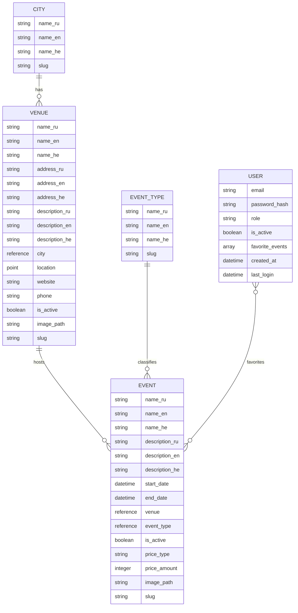

# Aggregator of Cultural Events (Project Plan)

## 1. Idea Description
A REST API for multilingual event aggregation system in Israeli cities that provides:
- Public access to events data
- Support for three languages (EN/RU/HE)
- Role-based content management
- Favorites for registered users

All interaction with the system through API endpoints (Postman)

## 2. Data Structure

### Entities and Their Roles:
- **City**: Base entity with multilingual names
- **Venue**: Physical locations with addresses and images
- **Event**: Main entity for events with schedules, pricing and images
- **EventType**: Categorization of events
- **User**: Authentication and authorization entity



### Database Choice Justification
MongoDB advantages for our system:
- Flexible schema for multilingual content
- Efficient handling of document relationships
- Good performance for read operations
- Easy scalability

## 3. Technologies

### Core Stack:
- **Backend**: Python/Flask
- **Database**: MongoDB with Mongoengine ODM
- **Authentication**: JWT tokens

### Key Libraries:
- **mongoengine**: MongoDB ODM
- **python-dotenv**: Environment configuration
- **Flask-CORS**: CORS support
- **requests**: External APIs integration (GeoNames)
- **bcrypt**: Password hashing
- **PyJWT**: JWT handling
- **python-slugify**: URL-friendly slugs
- **logging**: Application logging

## 4. Feature List

### Core Features:
- CRUD operations for all entities:
  - Cities management
  - Venues management
  - Events management
  - Event types management
  - User management
- Multilingual support (EN/RU/HE)
- Role-based access control
- Event favorites system
- File upload for images
- Request rate limiting
- System logging
- API documentation

### Optional Features (if time permits):
- Automated tests
- Enhanced logging features
- Automated cleanup of past events

## 5. API Structure

### Public Endpoints:
```
# Events
GET /api/v1/events/
GET /api/v1/events/{slug}

# Venues
GET /api/v1/venues/
GET /api/v1/venues/{slug}

# Cities
GET /api/v1/cities/
```

### Auth Required Endpoints:
```
# Users & Authentication
POST /api/v1/users/register
POST /api/v1/users/login

# User Features
GET /api/v1/users/{id}/favorites
POST /api/v1/users/{id}/favorites/{event_slug}
DELETE /api/v1/users/{id}/favorites/{event_slug}

# Admin/Manager Routes
POST, PUT, DELETE /api/v1/events/
POST /api/v1/events/{slug}/image
POST, PUT, DELETE /api/v1/venues/
POST /api/v1/venues/{slug}/image
POST, PUT, DELETE /api/v1/cities/
```

## 6. Timeline

### Week 1:
- Database models implementation
- Basic CRUD operations
- Authentication system
- File upload functionality
- Logging setup

### Week 2:
- Role-based access control
- Favorites system
- Rate limiting implementation
- Automated tasks setup
- Testing and bug fixes
- Deployment
- Project presentation
